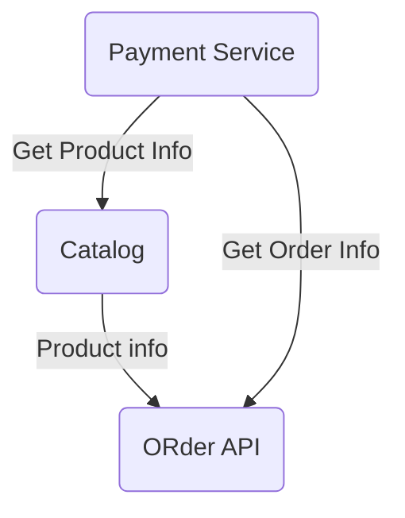

# Service Signer 

## Overview 

Service Signer util is a mechanism of checkgin integrity of each service and  validating their results. The services that has an interaction of data between themselves does not need to use any  online  call for checking the data that is been provided. We are using digital signature technigue in here.    

Example of MOdels 
Thera are Services that has an interaction between . A , B ,C ,D 
Lets call 


* A -  Catalog Service 
    - Provides Products with prices 
* B -  Order Service 
    - Provide ORder Creation 
    - get order by id 
* C - Payment Service 
    - Create Payment for ORder 
    - Verify Order information 
    - Verify Product Information 



Using This technique you don't need to call the each api for verifying their results. 

## Service Signer Elements 
    Each service has their own key pairs(public , private). First You have to generate them. Then you have to initialize the service signer with  signer key(private). It means the data that your service produce will be signed, and not all of the elements needs to be signed. If it is a complex model you can mark them , if it is primitive type no need for that.  

## Installation

```java
 string signalg = "SHA-256withRSA";
 var keypair = Util.GetKeyPairProvider("rsa").GenerateServiceKeyPair(2048);
 var servicesigner = Util.GetSigner("rsa");
 var privstring = keypair.Private.SerializePrivateKeyToBase58();
 var pubstring = keypair.Public.SerializePublicKeyToBase58();
```

privstring is your private key. pubstring is a shared key. 


## Sign Something 

### Sign Primitive types. Int , date , string , byte etc ...


```java
 ServiceSigner srvsigner = new ServiceSigner(ServiceSignerBase.Enums.SignAlgorithms.RsaSha256, privstring, pubstring);
 int tobesigned = 0; // signed payload
 var result = srvsigner.SignData(tobesigned);
```
we are signing the '0' as a payload. 
that is what we get. 
```json
{
  "Version": "1.0.1",
  "Payload": 0,
  "Header": {
    "Pattern": null,
    "Alg": "SHA-256withRSA",
    "Signature": "7KgHk1F8uEEDx2unLAZQvTojMMXEuHSq6safCNAqvXcVkHCsXvUMqbpc5upYDgLfyAeLM8HiPjkVHQmdzzWXKnFMD4LetkYNPxRdbjPiwVYhULJgGzWJSfkwiewkJ9aQ8Vr1oJugwDxwqAnvBnye9oLqb483XWErV79TLcXLJf8YjHNMGViNajdmYQd4CnqMWxuJaaSZMJcWUajA2NBwcJ9bNqckTn5soUcDWAZ9ukjJzLC11U1tcGUwhBT59PSX9i8LVQTmpcNgxWH4hCoFiSnaRU9sRR3wMJTPjdLchgyhpteaBYwKXC8Us6WshhUeKXbp96rG2h3fh1fXTdNFbEqHe8ooF9"
  }
}
```

the same example can be showed with other  single types. 

### Complex type singing
Th  model that you want not sign 

```java
  public class SomeModel
    {
        [Signable]
        public string Name { get; set; }
        public string TestData { get; set; }
        [Signable]
        public string Surname { get; set; }
        [Signable]
        public DateTime DateTime { get; set; } = DateTime.Now;
        public InnerModel InnerModel { get; set; }
    }
    //name+surname
    public class InnerModel
    {
        public string Id { get; set; } = "TestID";
        [Signable]
        public int Year { get; set; }
        public ThirdObject HidedObject { get; set; }
    }
    public class ThirdObject
    {
        [Signable]
        public string HidedName { get; set; }
        [Signable]
        public long LongProp  { get; set; }
        public InnerModel ModelSam { get; set; }
    }
```

All the properties that is been marked as a **Signable** will be signed. 

The Output 
```json
{
  "Version": "1.0.1",
  "Payload": {
    "Name": "farid",
    "TestData": "Test",
    "Surname": "Ismayilzada",
    "DateTime": "2023-04-22T18:48:37.3287232+04:00",
    "InnerModel": {
      "Id": "TestID",
      "Year": 2022,
      "HidedObject": {
        "HidedName": "Secret",
        "LongProp": 50000,
        "ModelSam": null
      }
    }
  },
  "Header": {
    "Pattern": "Name/Surname/DateTime/InnerModel.Year/InnerModel.HidedObject.HidedName/InnerModel.HidedObject.LongProp",
    "Alg": "SHA-256withRSA",
    "Signature": "7U4uc7VAEijstMhre6LFXCPLmxPaLp4WDfC9wVJRYr5KDnjn2YA5Y8E9bYcJakpVQrv3qUtz7di3wRfLcx2J3Yt3gDjRGnhfAh4Pr3BcLXBLtmqSVB82fgrQc88fAgURqXBdh3o6dNjxdity89zpMMHgGV98BqHJmS5ijtFzTh42tqhRBKmDUF5Fcmv5p1NbTepSprqQfuYHsZ3ZEyHKSP84dJJxZRQLUXWHUmn6fwvD5vTyhqX3n36HPm129B5h2QDgofo6rKp6DNep1FiuRrs9j9mqBjVUb8eGVYfZAPwctPa3VexxpvZZ1uWxhZvusnRoyNua4c6jy225CjDdG9RXDfS6P1"
  }
}
```


## Verify the Record of other service 

```java
 var decer = JsonSerializer.Deserialize<SrvSignedContainer<SomeModel>>(text);
 decer.ValidateSignature(pubstring);
 signer.ValidateSignatureContainer(decer, pubstring);
```

Pubstring is shared key of the service that the data belongs. 
