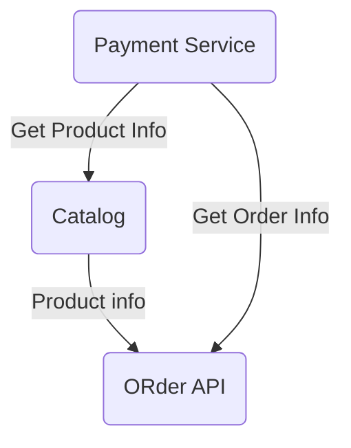

# Service Signer

Introducing "Service Signer" - a powerful library designed to enhance your API interactions. With Service Signer, you can effortlessly sign each request to any service and receive authenticated responses. By implementing key pair logic (public and private keys), this library ensures the security and integrity of your API communications. Say goodbye to manual response validation requests, as Service Signer significantly reduces the need for such interactions, helping you optimize and decrease your overall request count. Streamline your API integration with ease and peace of mind using Service Signer.


# Overview

Introducing Service Signer Util - a robust mechanism for ensuring the integrity of each service, signing and validating their results. This powerful utility enables seamless data interaction between services without the need for online calls to verify the provided data. Leveraging cutting-edge digital signature techniques, Service Signer Util guarantees the authenticity and reliability of the exchanged information. Say goodbye to unnecessary online checks and embrace a streamlined, secure, and efficient data communication system between your services.

Let's deep dive with the examples:
Imagine a scenario with four services - A, B, C, and D:

* A -  Catalog Service 
    - Provides Products with prices 
* B -  Order Service 
    - Provide ORder Creation 
    - get order by id 
* C - Payment Service 
    - Create Payment for ORder 
    - Verify Order information 
    - Verify Product Information 



These services interact with each other, and Service Signer simplifies the process of checking the data they exchange.


## Service Signer Elements

`Each service has its own key pairs (public and private). You'll need to generate these key pairs and initialize the service signer with the private key. The data produced by your service will be signed, and you can choose which elements need to be signed, based on the complexity of the model.`

## Installation
You can download the ServiceSignerBase package from NuGet Package Manager using the following command:
```java
dotnet add package ServiceSignerBase --version 1.0.2
```
Once installed, you can start using the Service Signer in your project.

First stage, generate key pairs for your service and save it on your environment(config file, settings, database etc). Then, share public key with the service that will consume and validate this service.
```java
 string signalg = "SHA-256withRSA";
 var keypair = Util.GetKeyPairProvider("rsa").GenerateServiceKeyPair(2048);
 var servicesigner = Util.GetSigner("rsa");
 var privstring = keypair.Private.SerializePrivateKeyToBase58();
 var pubstring = keypair.Public.SerializePublicKeyToBase58();
```
**NOTE:** **The key generation process is not part of the application cycle. It must be created externally and then must be added to the application environment.**

## Sign Something
### Sign Primitive types. Int , date , string , byte etc ...

```java
 ServiceSigner srvsigner = new ServiceSigner(ServiceSignerBase.Enums.SignAlgorithms.RsaSha256, privstring, pubstring);
 int tobesigned = 0; // signed payload
 var result = srvsigner.SignData(tobesigned);
```
In this example, we are signing the value '0' as the payload. The resulting signed payload will look like this in JSON format:
```json
{
	"Version": "1.0.1",
	"Payload": 0,
	"SignedModelType": "Int32",
	"Header": {
		"Pattern": null,
		"Alg": "SHA-256withRSA",
		"Signature": "3y2Con4UdVoyskfbVuFaGmtuF98cYcpVsLrZjE31f9mdtfanNUBNjzF4pnG9sS7Mu9CfCJDN8tB3d3m2XHn8JTgMVceMtfgohNwzayGM6GbaanywJvFa3yaLDcLmnRdiE3496YtNtxzpMmfxs5Za6fEUPxa5B7EE5XJE6CY4B7UzMyQEah38DbfwgyA588b4KNY3D6LbJRCb5hVtwLkYdE8p7dpLrhXEs8AYPnbhrQ2YvfK9cdSGzUXUKyN8gstCqw1Y6ZX2rA9NzEq3wkhUJnWBXWZHDpgsaiSqsDzQTBNE8tctRUa6EGSFV5YjMcELtCv1zxbSi4T4jZ6iSFiLcr5nLddRA8"
	}
}
```
This technique can be applied to other single types as well.
### Complex Type Signing
For complex models, you can choose which properties to sign by marking them with **[Signable]**.
```java
  public class SomeModel
    {
        [Signable]
        public string Name { get; set; }
        public string TestData { get; set; }
        [Signable]
        public string Surname { get; set; }
        [Signable]
        public DateTime DateTime { get; set; } = DateTime.Now;
        public InnerModel InnerModel { get; set; }
    }
    //name+surname
    public class InnerModel
    {
        public string Id { get; set; } = "TestID";
        [Signable]
        public int Year { get; set; }
        public ThirdObject HidedObject { get; set; }
    }
    public class ThirdObject
    {
        [Signable]
        public string HidedName { get; set; }
        [Signable]
        public long LongProp  { get; set; }
        public InnerModel ModelSam { get; set; }
    }
```
All properties marked with **[Signable]** will be signed. The output will look like this in JSON format:
```json
{
  "Version": "1.0.1",
  "SignedModelType": "SomeModel",
  "Payload": {
    "Name": "farid",
    "TestData": "Test",
    "Surname": "Ismayilzada",
    "DateTime": "2023-04-22T18:48:37.3287232+04:00",
    "InnerModel": {
      "Id": "TestID",
      "Year": 2022,
      "HidedObject": {
        "HidedName": "Secret",
        "LongProp": 50000,
        "ModelSam": null
      }
    }
  },
  "Header": {
    "Pattern": "Name/Surname/DateTime/InnerModel.Year/InnerModel.HidedObject.HidedName/InnerModel.HidedObject.LongProp",
    "Alg": "SHA-256withRSA",
    "Signature": "7U4uc7VAEijstMhre6LFXCPLmxPaLp4WDfC9wVJRYr5KDnjn2YA5Y8E9bYcJakpVQrv3qUtz7di3wRfLcx2J3Yt3gDjRGnhfAh4Pr3BcLXBLtmqSVB82fgrQc88fAgURqXBdh3o6dNjxdity89zpMMHgGV98BqHJmS5ijtFzTh42tqhRBKmDUF5Fcmv5p1NbTepSprqQfuYHsZ3ZEyHKSP84dJJxZRQLUXWHUmn6fwvD5vTyhqX3n36HPm129B5h2QDgofo6rKp6DNep1FiuRrs9j9mqBjVUb8eGVYfZAPwctPa3VexxpvZZ1uWxhZvusnRoyNua4c6jy225CjDdG9RXDfS6P1"
  }
}
```
## Verify the Record of Other Service 

While checking the integrity of the signed model if the data has been changed the `SrvInvalidSignatureException` exception will be thrown.

To verify a record from another service, use the following:
```java
 var decer = JsonSerializer.Deserialize<SrvSignedContainer<SomeModel>>(text);
 decer.ValidateSignature(pubstring);
 signer.ValidateSignatureContainer(decer, pubstring);
```

`pubstring` represents the shared key of the service to which the data belongs.
